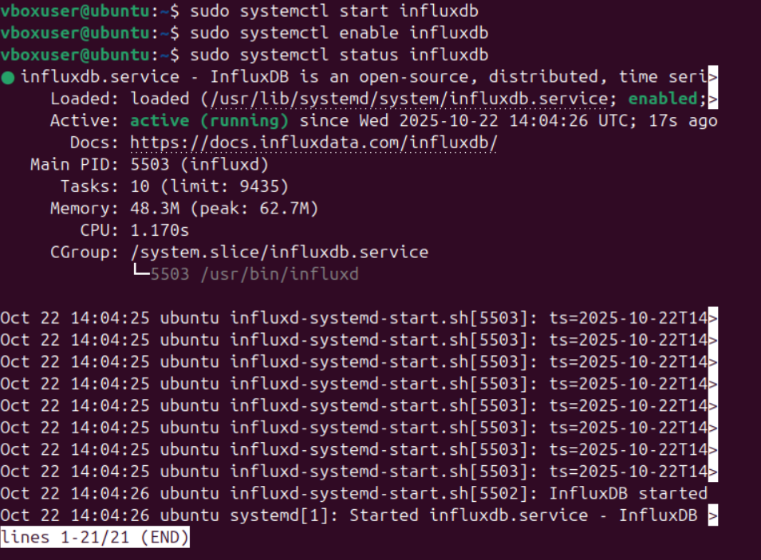
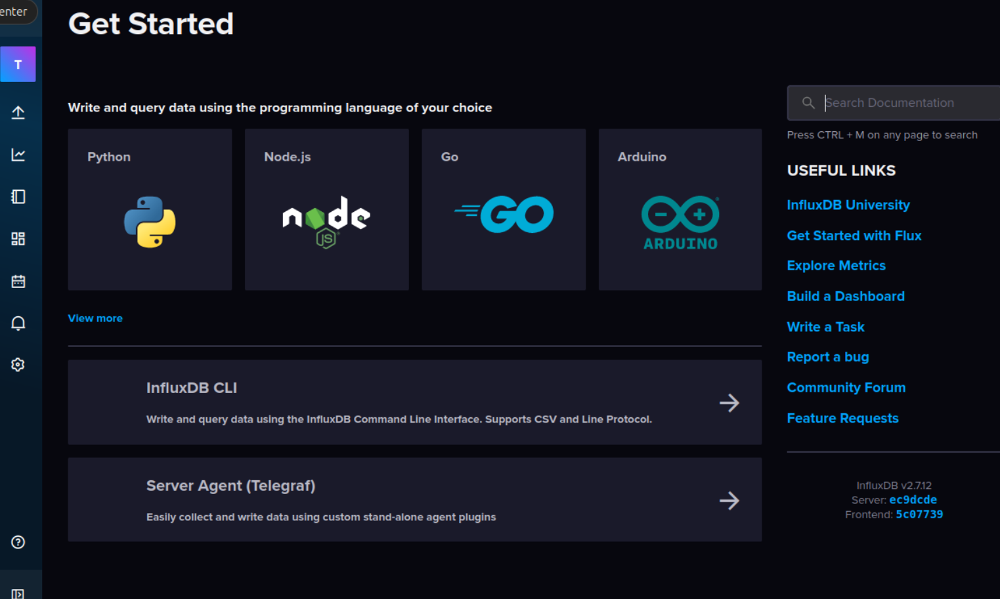
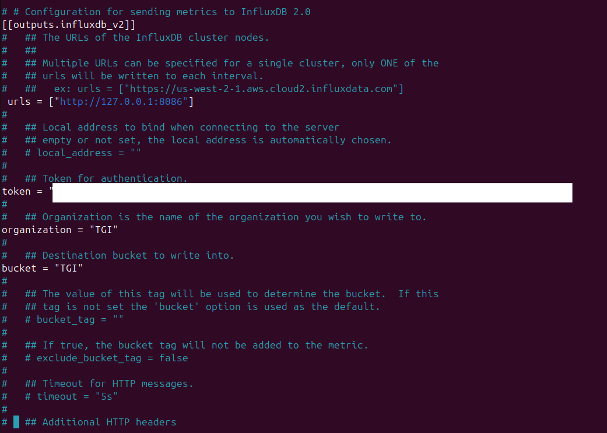
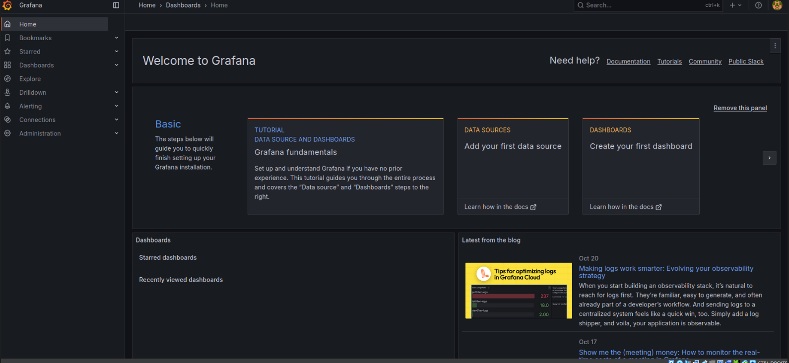
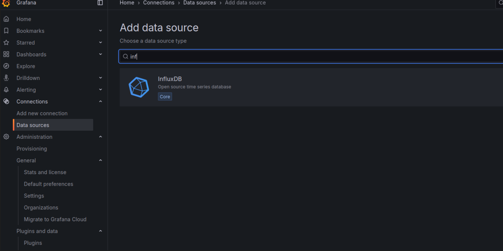

<body>
  <h1>Setting Up TIG Stack (Telegraf, InfluxDB, Grafana) on Ubuntu</h1>
  <div class="section">
    <h2>Step 1: Update Your System</h2>
    <pre><code>sudo apt update && sudo apt upgrade -y</code></pre>
  </div>

  <div class="section">
    <h2>Step 2: Install InfluxDB</h2>
    <p>Add InfluxData repository key and list:</p>
    <pre><code>curl -sL -O https://repos.influxdata.com/influxdata-archive.key
sudo gpg --dearmor -o /etc/apt/keyrings/influxdata-archive.gpg influxdata-archive.key
echo "deb [signed-by=/etc/apt/keyrings/influxdata-archive.gpg] https://repos.influxdata.com/debian stable main" | sudo tee /etc/apt/sources.list.d/influxdata.list</code></pre>
    <p>Update and install InfluxDB:</p>
    <pre><code>sudo apt update && sudo apt install influxdb2 -y
sudo systemctl start influxdb
sudo systemctl enable influxdb</code></pre>
  </div>

  <div class="section">
    <h2>Step 3: Set Up InfluxDB</h2>
    <p>Visit <code>http://localhost:8086</code> in a browser and complete setup. Or use CLI:</p>
    <pre><code>influx setup --username your_username --password your_password --org your_org --bucket monitoring --force</code></pre>
  </div>
  <p align="center">
  
</p>
<p align="center">
  
</p>


  <div class="section">
    <h2>Step 4: Install Telegraf</h2>
    <pre><code>sudo apt install telegraf -y
sudo systemctl start telegraf
sudo systemctl enable telegraf</code></pre>
  </div>

  <div class="section">
    <h2>Step 5: Configure Telegraf</h2>
    <p>Edit configuration:</p>
    <pre><code>sudo nano /etc/telegraf/telegraf.conf</code></pre>
    <p>Set the following values in <code>[[outputs.influxdb_v2]]</code>:</p>
    <pre><code>urls = ["http://127.0.0.1:8086"]
token = "YOUR_TOKEN"
organization = "your_org"
bucket = "monitoring"</code></pre>
  </div>
  <p align="center">
  
</p>

  <div class="section">
    <h2>Step 6: Install Grafana</h2>
    <pre><code>sudo apt install -y apt-transport-https software-properties-common wget
wget -q -O - https://apt.grafana.com/gpg.key | sudo gpg --dearmor -o /etc/apt/keyrings/grafana.gpg
echo "deb [signed-by=/etc/apt/keyrings/grafana.gpg] https://apt.grafana.com stable main" | sudo tee /etc/apt/sources.list.d/grafana.list
sudo apt update
sudo apt install grafana -y
sudo systemctl start grafana-server
sudo systemctl enable grafana-server</code></pre>
  </div>

  <div class="section">
    <h2>Access Grafana</h2>
    <p>Visit <code>http://localhost:3000</code>. Default login: <code>admin/admin</code>.</p>
  </div>
</body>
</html>
<p align="center">
  
</p>
### Step 7: Set Up Grafana
1. Open your browser and go to `http://localhost:3000` (default login: admin/admin; change the password when prompted).


2. Add InfluxDB as a data source:
- Go to Connections > Data Sources > Add data source > InfluxDB.
  <p align="center">
  
</p>
- Set Query Language to "Flux" (recommended for v2+).
- URL: `http://localhost:8086`
- Organization: "your_org"
- Token: "your_api_token_from_step_3"
- Default Bucket: "monitoring"
- Save & Test (it should say "Data source is working").


3. Create a dashboard:
- Go to Dashboards > New > New Dashboard.
- Add a panel > Select your InfluxDB data source.
- Use Flux queries for metrics, e.g., for CPU usage:


```flux
from(bucket: "monitoring")
|> range(start: v.timeRangeStart, stop: v.timeRangeStop)
|> filter(fn: (r) => r["_measurement"] == "cpu")
|> filter(fn: (r) => r["_field"] == "usage_user" or r["_field"] == "usage_system")
|> aggregateWindow(every: v.windowPeriod, fn: mean, createEmpty: false)
|> yield(name: "mean")
```


- Customize the visualization (e.g., time series graph).
- Repeat for other metrics like memory (`mem > used_percent`) or disk (`disk > used_percent`).
- Save the dashboard.


Grafana has pre-built dashboards; import one for Telegraf system metrics via Dashboards > Import (ID: 928 for basic system dashboard).


### Step 8: Secure and Optimize
- **Firewall**: Allow ports if using ufw: `sudo ufw allow 8086/tcp` (InfluxDB), `sudo ufw allow 3000/tcp` (Grafana).
- **HTTPS**: For production, configure SSL for Grafana and InfluxDB (edit their config files).
- **Remote Access**: If monitoring multiple machines, install Telegraf on each and point to the central InfluxDB.
- **Backups**: Use `influx backup` for data.
- **Testing**: Install `stress` (`sudo apt install stress`) and run `stress --cpu 4 --timeout 60` to simulate load and monitor in Grafana.


If data isn't appearing, check logs: `journalctl -u telegraf`, `journalctl -u influxdb`, `journalctl -u grafana-server`.


This setup gives you a basic monitoring system. Expand by adding more Telegraf inputs (e.g., for Docker).
